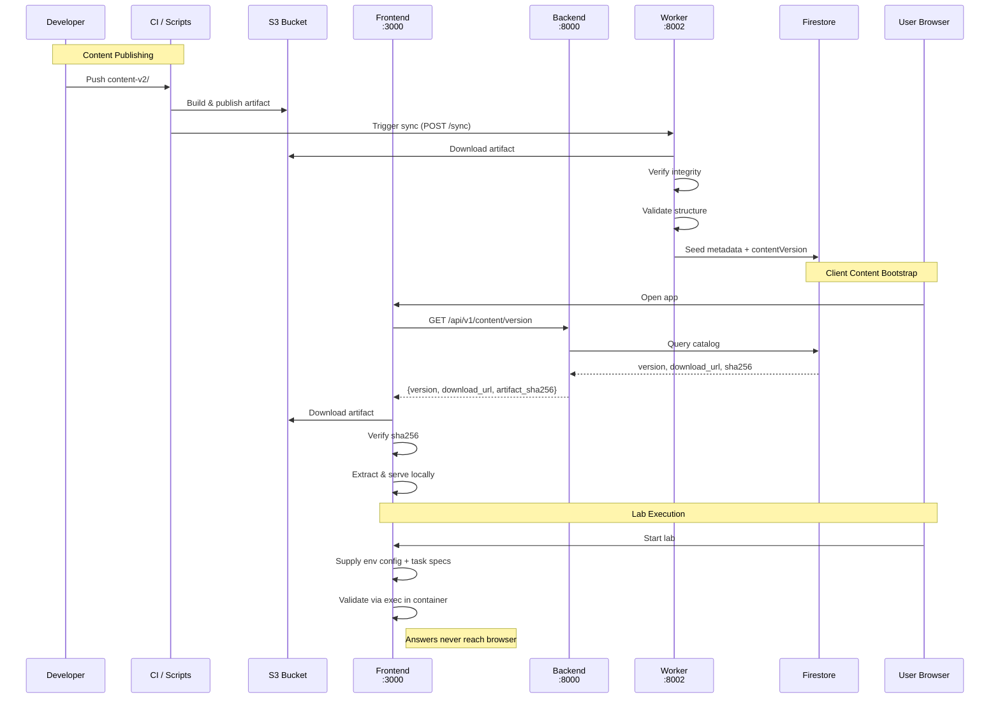

# LabOps — DevOps Learning Platform

## Features

LabOps is a local-first, open-source KodeKloud alternative: hands-on DevOps and container sandboxes running right on your laptop with zero cloud bills.

- **Authentic terminal, right in your browser** — LabOps drops you straight into a real Linux command line. You get hands-on experience with production tools without dealing with broken local dependencies or manual installs.
- **Safe, breakable playgrounds** — You get full root access to experiment, run services, and test risky commands. LabOps keeps everything walled off, so there is zero chance of messing up your personal laptop.
- **Instant, step-by-step grading** — You never have to guess if you got a task right. LabOps checks your actual files and system settings in the background, giving you a green checkmark when it works or clear hints when something is missing.
- **Try commands as you read** — No more switching between documentation tabs and separate terminal windows. LabOps embeds interactive mini-terminals directly into the text so you can test concepts the second you read about them.
- **Zero waiting around** — LabOps boots lightweight practice environments in just a few seconds. You spend your time learning and building, not waiting on slow setup scripts or heavy virtual machines.
- **Clear, structured learning path** — You always know what to learn next. LabOps breaks down intimidating DevOps topics into manageable, hands-on tasks that track your progress from your first command to advanced architectures.

## Architecture

### System Overview


### Content Delivery Flow



### Service Responsibilities

| Service | Port | Responsibility |
|---------|------|----------------|
| **frontend** `next-app/` | 3000 | Auth, learning wizard, xterm.js terminal, **content bootstrap** — downloads the published artifact from S3, verifies its sha256, extracts locally, and serves chapters/lab config from local files |
| **backend** `backend/` | 8000 | Pure metadata + data-location API: Firebase auth, catalog/TOC from Firestore, enrollment/progress, lab lifecycle proxy, version handshake. **Reads no content files** |
| **worker** `worker/` | 8002 | **S3-only**: downloads the artifact, verifies integrity, validates, seeds Firestore (polling + `POST /sync`) |
| **orchestrator** `orchestrator/` | 8001 | Docker container lifecycle, exec, WebSocket terminal — runs **inside the Vagrant VM as a systemd service** (guest `:8000` → host `:8001`), keeping the VM daemon free for lab containers |

**Content delivery:** `content-v2/` is the source of truth, published to S3 by
CI/scripts. The worker seeds Firestore metadata; the frontend downloads the bytes
and serves them locally. The backend never touches course files.

### Container Runtime Modes & Host Security Boundaries

The orchestrator dynamically manages lab containers using two runtime modes controlled by the `CONTAINER_RUNTIME_MODE` environment variable:

| Mode | Runtime Engine | Docker Flag | Intended Host Platform | Security Isolation Mechanism |
|------|---------------|-------------|------------------------|------------------------------|
| **`sysbox`** *(default / recommended)* | `sysbox-runc` | `privileged: false` | Ubuntu Host (bare-metal, cloud VM, WSL2, Vagrant VM) | Linux User Namespaces (`userns`), cgroups, `/proc` & `/sys` virtualization |
| **`privileged`** *(fallback)* | standard `runc` | `privileged: true` | Windows / macOS via Docker Desktop | WSL2 / Hyper-V utility VM isolation boundary |

#### Runtime Architecture & Fallback Hierarchy:

```
┌────────────────────────────────────────────────────────────────────────┐
│  Tier 1: Native Linux (Ubuntu 22.04 / Debian)                          │
│  ➜ Production Target: Direct Sysbox CE + rootless userns isolation    │
├────────────────────────────────────────────────────────────────────────┤
│  Tier 2: Windows + WSL2 (Ubuntu 22.04, WSL2 Kernel ≥ 5.12)             │
│  ➜ Development / Testing: Native Sysbox with daemon.json adjustment   │
│  ➜ Fast, direct, zero Vagrant VM overhead                              │
├────────────────────────────────────────────────────────────────────────┤
│  Tier 3: Docker Desktop Dev Mode                                       │
│  ➜ Local Dev: CONTAINER_RUNTIME_MODE=privileged (WSL2 hypervisor safe) │
├────────────────────────────────────────────────────────────────────────┤
│  Tier 4: Vagrant VM Fallback (VirtualBox / VMware / Hyper-V)           │
│  ➜ Universal Fallback: Completely isolated guest VM environment        │
└────────────────────────────────────────────────────────────────────────┘
```

#### Critical Host Security Principles:
- **Ubuntu / Linux Hosts — NEVER use `privileged` mode**:
  On a native Ubuntu or Linux host system (including the Vagrant Ubuntu VM guest), running containers in `privileged` mode disables user namespace isolation and grants the container root-equivalent access to host devices (`/dev`), kernel parameters, and the host filesystem. A student executing `docker run` or malicious scripts could easily escape to compromise the host. For Linux/Ubuntu, the orchestrator **must strictly use `sysbox` mode** (`sysbox-runc`), which enables rootless system containers with isolated daemons and systemd without root privilege on the host.
- **Docker Desktop on Windows — Safe in `privileged` mode (WSL2 Security Boundary)**:
  Running `CONTAINER_RUNTIME_MODE=privileged` on Windows Docker Desktop is safe because Docker Desktop executes inside a dedicated utility VM. The **WSL2 virtual machine itself acts as the hardware virtualization security boundary**, isolating container processes from the underlying Windows host operating system.

---

> ### 💡 Fun Fact & Discovery: Native Sysbox on Windows (WSL2 without Vagrant!)
>
> It was historically assumed that Windows developers could *only* run Sysbox by provisioning a heavyweight Vagrant / VirtualBox / VMware VM. 
> 
> **We validated that Windows + WSL2 (Ubuntu 22.04 LTS, Kernel $\ge$ 5.12) can run Sysbox CE natively without Vagrant.**
>
> #### Validated WSL2 Compatibility Matrix:
> | Component | Validated Version / Configuration |
> |---|---|
> | **Host OS** | Windows 10/11 + WSL2 |
> | **Linux Distro** | Ubuntu 22.04.5 LTS (Jammy) |
> | **WSL2 Kernel** | `6.6.87.2-microsoft-standard-WSL2` (or any kernel $\ge$ 5.12 with ID-mapped mounts) |
> | **Docker Engine & CLI** | `29.6.1` (or compatible Docker CE) |
> | **Sysbox CE** | `0.7.0` (`sysbox-runc`) |
> | **Sysbox Runtime Selection** | `--runtime=sysbox-runc` |
>
> #### The Critical Compatibility Fix (`/etc/docker/daemon.json`):
> Recent Docker versions automatically request the Linux **Time Namespace** (`CLONE_NEWTIME`), which causes Sysbox 0.7.0 to fail with `namespace {"time" ""} does not exist`. 
> 
> By setting `"time-namespaces": false` in `/etc/docker/daemon.json` inside your WSL2 distro, Sysbox runs smoothly:
>
> ```json
> {
>   "features": {
>     "cdi": false,
>     "time-namespaces": false
>   },
>   "runtimes": {
>     "sysbox-runc": {
>       "path": "/usr/bin/sysbox-runc"
>     }
>   }
> }
> ```
>
> With this simple adjustment, Windows developers can test real nested Docker and systemd labs with native Linux performance inside WSL2 — leaving Vagrant as the furthest fallback if everything else fails!

---

## Setup (new developer)

Full step-by-step guide: **[`docs/2-development/setup.md`](docs/2-development/setup.md)**

Key points for a fresh clone:

1. **Credentials** — you need a Firebase service-account JSON, the web API key,
   and (for the real-AWS dev/beta stacks) **AWS IAM credentials**:
   - Place your dev service account in `environments/dev/firebase/FIREBASE_CREDS_JSON_DEV.json`.
   - Fill the 6 `NEXT_PUBLIC_FIREBASE_*` values in `environments/dev/frontend/.env.dev`.
   - Fill `AWS_ACCESS_KEY_ID`, `AWS_SECRET_ACCESS_KEY`, `AWS_REGION`, and
     `CONTENT_PUBLIC_BASE_URL` in `environments/dev/.env.dev`. The backend uses
     these to **sign presigned S3 download URLs** on
     `/api/v1/content/version`, so without them the content bootstrap fails with
     a `403 Forbidden` on the S3 download. The IAM principal needs `s3:GetObject`
     on the bucket's `published/*` (see
     [`docs/aws-s3-private-downloads.md`](docs/aws-s3-private-downloads.md)).
2. **Start Docker Stack** — The local environment includes the Next.js frontend, Python FastAPI backend, and Floci (LocalStack). Run:
   ```bash
   docker compose -f docker-compose.local.yml up -d
   ```
3. **Deploy Local AWS Resources & Content** — We use an automated script to provision the local S3 bucket, build the Python Lambda Worker packages, publish the Layer, and upload the content to trigger the sync:
   - On Windows: run `scripts\local\deploy_floci_lambda.bat`
   - It will automatically seed the content to Floci and trigger the Lambda.
4. **Start Vagrant VM** — `vagrant up` to boot the VM and orchestrator.
5. **Open** — http://localhost:3000.

## Environments & Publishing Pipeline

The repository is structured with clear separation between local dev and remote environments:
- **Local Dev**: Run via `docker-compose.local.yml`. Local scripts live in `scripts/local/`.
- **Dev**: Pushing to the `dev` branch triggers `.github/workflows/publish-content-dev.yml` to deploy content to the Dev S3 bucket.
- **Beta**: Pushing a tag like `v1.0.0-beta` triggers `.github/workflows/publish-content-beta.yml` to deploy content to the Beta S3 bucket and environment.

## Quick Start (index)

| Step | See |
|------|-----|
| Environment + publish content + start the stack and VM | [`docs/2-development/setup.md`](docs/2-development/setup.md) |
| Hot reload, volume mounts, commands, pitfalls | [`docs/2-development/development.md`](docs/2-development/development.md) |
| Manual end-to-end test suite | [`docs/2-development/TESTING.md`](docs/2-development/TESTING.md) |
| Postman API suite | [`postman/README.md`](postman/README.md) |

## Current Status & Progress

**Working**
- **Dual Orchestrator Runtime Modes**: `sysbox` mode (`sysbox-runc`, unprivileged) for secure isolation on Ubuntu/Linux/Vagrant, and `privileged` mode fallback for Docker Desktop on Windows/macOS where the WSL2 utility VM provides the virtualization security boundary.
- **Client Content Bootstrap**: Presigned S3 private download handshake (`GET /api/v1/content/version`), sha256 checksum verification, and local tarball extraction with zero backend content coupling.
- **Cloud Backend & Serverless Worker**: Decoupled FastAPI metadata API backed by Firestore, and webhook-driven AWS Lambda worker (`worker/lambda_function.py`) for automatic Firestore metadata reconciliation.
- **Multi-Environment Infrastructure**: Full separation across `local` (Floci emulation), `dev`, and `beta` environments with automated GitHub Actions CI/CD (`build-images.yml`, `publish-content-dev.yml`, `publish-content-beta.yml`) publishing to AWS S3 and GHCR.
- **LabOps CLI Distribution**: Standalone Go CLI tool (`cli/`) with pre-compiled binaries for Windows (`labops.exe`), Linux, and macOS (`doctor`, `setup`, `start`, `stop`, `logs`).
- **Container Lifecycle & In-Chapter Demos**: Label-based container session recovery (`com.labops.*`), real-time state validation (exit code, port, file check), and interactive chapter demo sandboxes (`labops-docker-fundamentals`, `labops-docker-build`).
- **Course Content Progress**:
  - *Docker Mastery*: Labs 1–13 fully implemented with active validation tasks (covering Docker Fundamentals, Building Images, and Container Networking modules).
  - *Git Fundamentals*: Complete course structure and curriculum index established; Lab 1 active with multi-task validation.

**Remaining / Open**
- Complete validation tasks for Docker Mastery (Labs 14–15: Persistent Storage) and Git Fundamentals (Labs 2–10).
- Replace dev-only static orchestrator shared secret with short-lived session tokens issued by the backend on lab start.
- Course content immutability enforcement (`structuralHash` verification).
- Automated end-to-end integration test harness across the multi-environment matrix.
- Backlog: [`docs/2-development/deferred-improvements.md`](docs/2-development/deferred-improvements.md)

## Docs

Role-based index (find the doc you need by what you're doing):
[**`docs/README.md`**](docs/README.md)

- [`docs/1-philosophy/PHASE-0.md`](docs/1-philosophy/PHASE-0.md) — problem definition + frozen decisions (*read before new work*)
- [`docs/3-content-creation/CONTENT-PIPELINE.md`](docs/3-content-creation/CONTENT-PIPELINE.md) — content format, validation, publishing, seeding, immutability (§11)
- [`docs/3-content-creation/CONTENT-AUTHORING.md`](docs/3-content-creation/CONTENT-AUTHORING.md) — lab/chapter authoring guide
- [`docs/archive/CLIENT-APP-PLAN.md`](docs/archive/CLIENT-APP-PLAN.md) — historical client-side content delivery plan
- [`docs/architecture.xml`](docs/architecture.xml) — architecture diagram (draw.io XML)
- [`docs/2-development/bugs.md`](docs/2-development/bugs.md) — resolved root causes + open bug
- Service READMEs: [`backend/`](backend/README.md) · [`next-app/`](next-app/README.md) · [`orchestrator/`](orchestrator/README.md) · [`orchestrator/schemas/`](orchestrator/schemas/README.md)