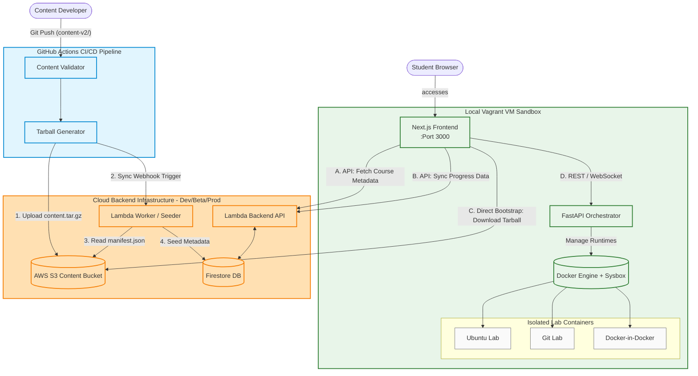
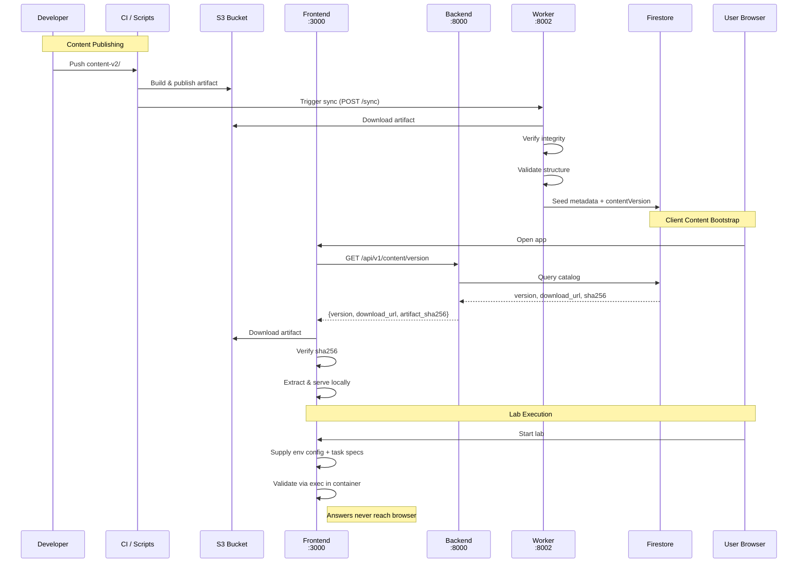

# LabOps — DevOps Learning Platform

A KodeKloud-style platform for learning Git and Docker through hands-on
interactive labs with real terminal environments.

## Architecture

### System Overview




### Content Delivery Flow



### Service Responsibilities

| Service | Port | Responsibility |
|---------|------|----------------|
| **frontend** `next-app/` | 3000 | Auth, learning wizard, xterm.js terminal, **content bootstrap** — downloads the published artifact from S3, verifies its sha256, extracts locally, and serves chapters/lab config from local files |
| **backend** `backend/` | 8000 | Pure metadata + data-location API: Firebase auth, catalog/TOC from Firestore, enrollment/progress, lab lifecycle proxy, version handshake. **Reads no content files** |
| **worker** `worker/` | 8002 | **S3-only**: downloads the artifact, verifies integrity, validates, seeds Firestore (polling + `POST /sync`) |
| **orchestrator** `orchestrator/` | 8001 | Docker container lifecycle, exec, WebSocket terminal — runs **inside the Vagrant VM as a systemd service** (guest `:8000` → host `:8001`), keeping the VM daemon free for lab containers |

**Content delivery:** `content-v2/` is the source of truth, published to S3 by
CI/scripts. The worker seeds Firestore metadata; the frontend downloads the bytes
and serves them locally. The backend never touches course files.

## Highlights

- **Version handshake** — `GET /api/v1/content/version` → `{version, download_url, artifact_sha256}`
- **Client-driven labs** — the frontend supplies the env config and task specs in
  request bodies; validation runs server-side (exec in the container), so answers
  never reach the browser
- **Task validation** — answer-based (`multiple_choice`) vs state-based
  (`terminal_action`/`port_check`/`file_check`, exit-code preferred over output match)
- **Session recovery** — containers carry `com.labops.*` labels; `start` re-attaches
  instead of duplicating after a restart
- **Guided in-chapter demos** — `:::terminal-demo` blocks → demo container + terminal

## Setup (new developer)

Full step-by-step guide: **[`docs/2-development/setup.md`](docs/2-development/setup.md)**

Key points for a fresh clone:

1. **Credentials** — you need a Firebase service-account JSON, the web API key,
   and (for the real-AWS dev/beta stacks) **AWS IAM credentials**:
   - Place your dev service account in `environments/dev/firebase/FIREBASE_CREDS_JSON_DEV.json`.
   - Fill the 6 `NEXT_PUBLIC_FIREBASE_*` values in `environments/dev/frontend/.env.dev`.
   - Fill `AWS_ACCESS_KEY_ID`, `AWS_SECRET_ACCESS_KEY`, `AWS_REGION`, and
     `CONTENT_PUBLIC_BASE_URL` in `environments/dev/.env.dev`. The backend uses
     these to **sign presigned S3 download URLs** on
     `/api/v1/content/version`, so without them the content bootstrap fails with
     a `403 Forbidden` on the S3 download. The IAM principal needs `s3:GetObject`
     on the bucket's `published/*` (see
     [`docs/aws-s3-private-downloads.md`](docs/aws-s3-private-downloads.md)).
2. **Start Docker Stack** — The local environment includes the Next.js frontend, Python FastAPI backend, and Floci (LocalStack). Run:
   ```bash
   docker compose -f docker-compose.local.yml up -d
   ```
3. **Deploy Local AWS Resources & Content** — We use an automated script to provision the local S3 bucket, build the Python Lambda Worker packages, publish the Layer, and upload the content to trigger the sync:
   - On Windows: run `scripts\local\deploy_floci_lambda.bat`
   - It will automatically seed the content to Floci and trigger the Lambda.
4. **Start Vagrant VM** — `vagrant up` to boot the VM and orchestrator.
5. **Open** — http://localhost:3000.

## Environments & Publishing Pipeline

The repository is structured with clear separation between local dev and remote environments:
- **Local Dev**: Run via `docker-compose.local.yml`. Local scripts live in `scripts/local/`.
- **Dev**: Pushing to the `dev` branch triggers `.github/workflows/publish-content-dev.yml` to deploy content to the Dev S3 bucket.
- **Beta**: Pushing a tag like `v1.0.0-beta` triggers `.github/workflows/publish-content-beta.yml` to deploy content to the Beta S3 bucket and environment.

## Quick Start (index)

| Step | See |
|------|-----|
| Environment + publish content + start the stack and VM | [`docs/2-development/setup.md`](docs/2-development/setup.md) |
| Hot reload, volume mounts, commands, pitfalls | [`docs/2-development/development.md`](docs/2-development/development.md) |
| Manual end-to-end test suite | [`docs/2-development/TESTING.md`](docs/2-development/TESTING.md) |
| Postman API suite | [`postman/README.md`](postman/README.md) |

## Current Status

**Working** — client content bootstrap (handshake → download → sha256 verify →
local extract → serve); Firestore-seeded catalog/TOC; enrollment + progress
(chapters, `labsProgress`); frontend ↔ orchestrator direct (lab lifecycle,
validation `exec`, tmux WebSocket terminal) with the backend fully decoupled
(metadata/progress/version handshake only); label-based session recovery +
restart-safe containers; guided chapter demos; worker full-reconcile sync. Live
content: `d139fdc9a662520e`.

**Remaining / open**
- 16/20 labs are skeleton stubs (tasks for labs 4–10 of both courses)
- **Commit `scripts/generate_manifest.py`'s raw-tar hash fix + the cp-based
  workflow** — CI still produces checksum-mismatched artifacts until pushed
  (see `docs/2-development/bugs.md`)
- Course immutability enforcement (`structuralHash`) · webhook-triggered sync
  (Item D, designed) · content-integrity sync + new-content badges · group-
  membership false-negative bug · automated test harness
- Backlog: [`docs/2-development/deferred-improvements.md`](docs/2-development/deferred-improvements.md)

## Docs

Role-based index (find the doc you need by what you're doing):
[**`docs/README.md`**](docs/README.md)

- [`docs/1-philosophy/PHASE-0.md`](docs/1-philosophy/PHASE-0.md) — problem definition + frozen decisions (*read before new work*)
- [`docs/3-content-creation/CONTENT-PIPELINE.md`](docs/3-content-creation/CONTENT-PIPELINE.md) — content format, validation, publishing, seeding, immutability (§11)
- [`docs/3-content-creation/CONTENT-AUTHORING.md`](docs/3-content-creation/CONTENT-AUTHORING.md) — lab/chapter authoring guide
- [`docs/archive/CLIENT-APP-PLAN.md`](docs/archive/CLIENT-APP-PLAN.md) — historical client-side content delivery plan
- [`docs/architecture.xml`](docs/architecture.xml) — architecture diagram (draw.io XML)
- [`docs/2-development/bugs.md`](docs/2-development/bugs.md) — resolved root causes + open bug
- Service READMEs: [`backend/`](backend/README.md) · [`next-app/`](next-app/README.md) · [`orchestrator/`](orchestrator/README.md) · [`orchestrator/schemas/`](orchestrator/schemas/README.md)