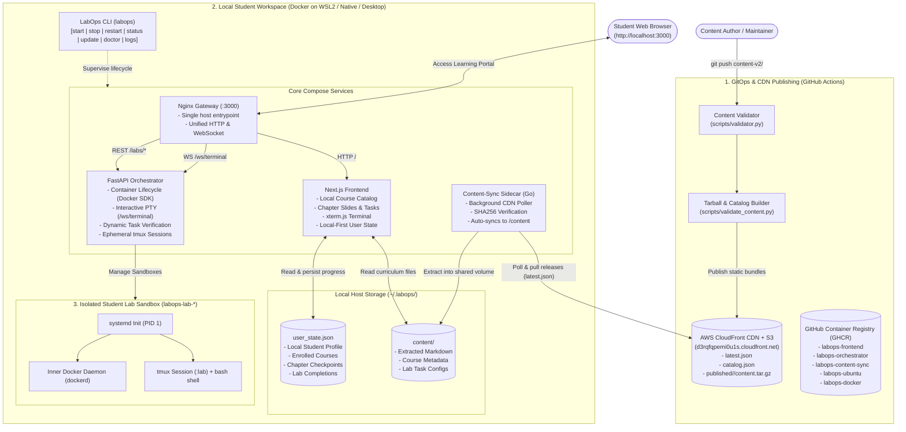
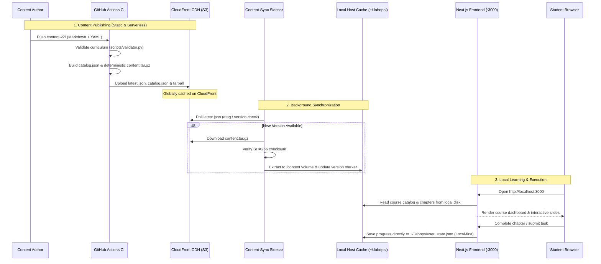

# LabOps — DevOps Learning Platform

## Features

LabOps is a local-first, open-source KodeKloud alternative: hands-on DevOps and container sandboxes running right on your laptop with zero cloud bills.

- **Authentic terminal, right in your browser** — LabOps drops you straight into a real Linux command line. You get hands-on experience with production tools without dealing with broken local dependencies or manual installs.
- **Safe, breakable playgrounds** — You get full root access to experiment, run services, and test risky commands. LabOps keeps everything walled off, so there is zero chance of messing up your personal laptop.
- **Instant, step-by-step grading** — You never have to guess if you got a task right. LabOps checks your actual files and system settings in the background, giving you a green checkmark when it works or clear hints when something is missing.
- **Try commands as you read** — No more switching between documentation tabs and separate terminal windows. LabOps embeds interactive mini-terminals directly into the text so you can test concepts the second you read about them.
- **Zero waiting around** — LabOps boots lightweight practice environments in just a few seconds. You spend your time learning and building, not waiting on slow setup scripts or heavy virtual machines.
- **Clear, structured learning path** — You always know what to learn next. LabOps breaks down intimidating DevOps topics into manageable, hands-on tasks that track your progress from your first command to advanced architectures.

## Architecture

### System Overview



### Content Delivery Flow



### Service Responsibilities

| Service | Host Port | Internal Port | Responsibility |
|---------|-----------|---------------|----------------|
| **`proxy`** `proxy/` | 3000 | 80 | Nginx reverse gateway: single unified entrypoint exposing the frontend (`/`), orchestrator REST APIs (`/labs/`, `/demos/`, `/health`), and WebSocket terminal (`/ws/terminal`). |
| **`frontend`** `next-app/` | *(proxied)* | 3000 | Next.js 15 UI: local course catalog, chapter slide player, task runner, xterm.js terminal integration, and local user progress persistence (`user_state.json`). **Zero remote backend or database calls.** |
| **`content-sync`** `sidecars/content-sync/` | — | — | Lightweight Go background daemon (< 8MB RAM, 0% CPU): continuously polls the CloudFront CDN (`latest.json`), verifies SHA256 integrity, and extracts content releases into the shared `/content` volume. |
| **`orchestrator`** `orchestrator/` | *(proxied)* | 8000 | FastAPI container supervisor: manages Docker sandbox containers (`labops-lab-*`), provides authenticated WebSocket terminal PTY sessions with pre-warmed `tmux`, and executes server-side validation checks. |
| **`cli`** `cli/` | — | — | Standalone Go executable (`labops`): local environment bootstrapper with zero plumbing exposure (`start`, `stop`, `restart`, `status`, `update`, `doctor`, `logs`). |

---

### Local-First & Zero-Cloud Design

LabOps is engineered around the principle of **Zero Cloud Bills & Pure Local Autonomy**:

1. **No Cloud Database (No Firestore)**: All student identity, enrolled courses, chapter checkpoints, and lab completion records are stored on the student's machine in `~/.labops/user_state.json`. Progress survives container restarts, updates, and offline environments.
2. **No Backend Microservice**: The legacy Python backend and Lambda workers were retired. Course structure, syllabus data, and metadata are served directly by Next.js from local files or cached static `catalog.json` files.
3. **No Auth Walls (No Firebase)**: The platform operates with instant local authentication. Students can jump directly into learning without third-party authentication cookies, login screens, or cloud dependencies.
4. **Static CDN Content Delivery**: Course content bundles are distributed as versioned, SHA256-verified static tarballs via AWS CloudFront (`d3rqfqpemi0u1s.cloudfront.net`).

---

### Container Runtime Modes & Host Security Boundaries

The orchestrator dynamically manages lab containers using two runtime modes controlled by the `CONTAINER_RUNTIME_MODE` environment variable:

| Mode | Runtime Engine | Docker Flag | Intended Host Platform | Security Isolation Mechanism |
|------|---------------|-------------|------------------------|------------------------------|
| **`sysbox`** *(default / recommended)* | `sysbox-runc` | `privileged: false` | Ubuntu Host (bare-metal, cloud VM, WSL2, Vagrant VM) | Linux User Namespaces (`userns`), cgroups, `/proc` & `/sys` virtualization |
| **`privileged`** *(fallback)* | standard `runc` | `privileged: true` | Windows / macOS via Docker Desktop | WSL2 / Hyper-V utility VM isolation boundary |

#### Runtime Architecture:

```
┌────────────────────────────────────────────────────────────────────────┐
│  Tier 1: Windows + Native WSL2 (Ubuntu 22.04 LTS)                      │
│  ➜ Preferred Windows Target: Lightweight open-source Docker engine     │
│  ➜ ~150MB RAM, zero commercial licensing issues, native Linux speed    │
├────────────────────────────────────────────────────────────────────────┤
│  Tier 2: Native Linux Host (Ubuntu / Debian / Arch)                    │
│  ➜ Direct Sysbox CE or standard Docker with user namespace isolation   │
├────────────────────────────────────────────────────────────────────────┤
│  Tier 3: Docker Desktop (Windows / macOS)                              │
│  ➜ Opportunistic: Automatically attaches to active Docker daemon       │
└────────────────────────────────────────────────────────────────────────┘
```

---

## Quick Start (For Students & Learners)

Running LabOps requires only the lightweight standalone CLI:

1. **Verify your machine**:
   ```bash
   labops doctor
   ```
2. **Launch your workspace**:
   ```bash
   labops start
   ```
   *LabOps automatically boots your local environment and opens `http://localhost:3000` in your browser.*

3. **Check status**:
   ```bash
   labops status
   ```

4. **Stop when finished**:
   ```bash
   labops stop
   ```

---

## Local Development (For Contributors)

To run the complete platform from source:

1. **Clone the repository**:
   ```bash
   git clone https://github.com/vmalani27/SGP-V.git
   cd SGP-V
   ```

2. **Start the local stack with Docker Compose**:
   ```bash
   docker compose up -d
   ```

3. **Access the platform**:
   - Web Learning Portal: `http://localhost:3000`
   - Orchestrator Health Check: `http://localhost:3000/health`
   - Content Directory: `~/.labops/content` (auto-synced from CloudFront)
   - User State: `~/.labops/user_state.json`

4. **Build the CLI binary**:
   ```bash
   cd cli
   ./build.sh        # On Linux/macOS
   build.bat         # On Windows
   ```

---

## Current Status & Roadmap

**Active & Production-Ready**
- **100% Local-First Architecture**: Complete removal of remote backends, Firestore, and Firebase authentication.
- **Static CloudFront CDN Content Pipeline**: Automated GitHub Actions CI publishing versioned curriculum bundles to AWS S3 / CloudFront with SHA256 checksum integrity.
- **Automated Content-Sync Sidecar**: Continuous, zero-downtime background sync service running in Go (< 8MB RAM).
- **Unified Gateway Proxy**: Single entrypoint (`http://localhost:3000`) for Next.js, FastAPI orchestrator, and WebSocket terminal.
- **Zero-Plumbing CLI**: User-friendly, clean CLI interface (`labops`) for environment lifecycle and system diagnostics.
- **Interactive Lab Sandboxes**: Pre-warmed `tmux` terminal sessions, dynamic verification tasks, and container lifecycle management.

**In Progress / Upcoming**
- Complete validation test suites for advanced persistent storage and Kubernetes modules.
- Course content immutability enforcement (`structuralHash` runtime validation).
- Offline bundle preloader for environments without internet access.