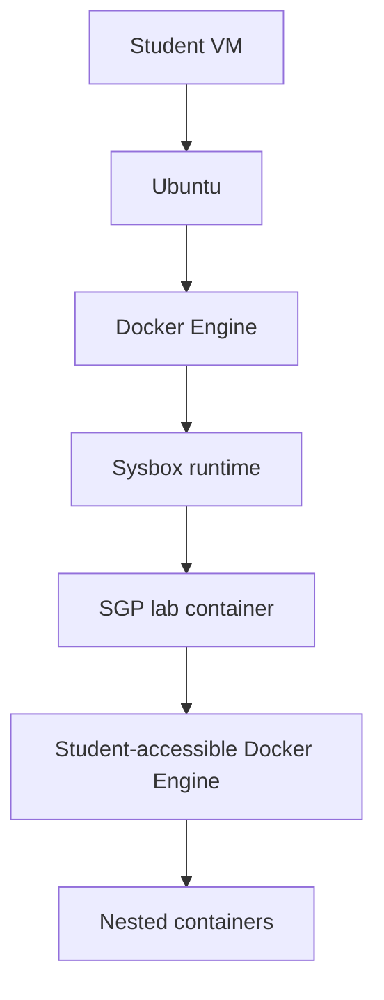
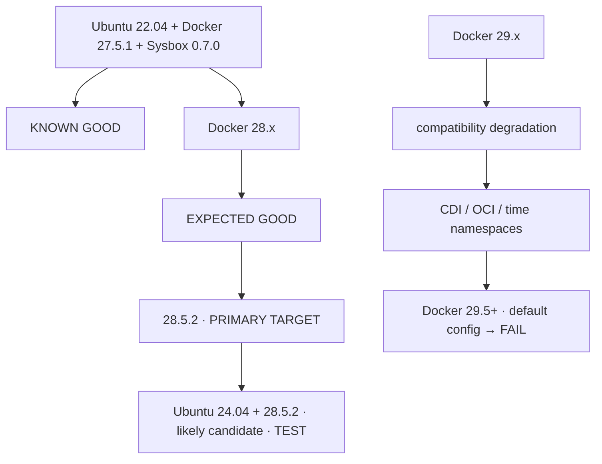

# Sysbox Compatibility Investigation

**Compatibility qualification exercise** for the eventual VMware/OVA appliance:
find the **highest practical Docker CE version** that runs the SGP
nested-Docker workload under Sysbox, and decide whether upgrading from
Ubuntu 22.04 to 24.04 is worthwhile.

> **This is not an upgrade task.** `Ubuntu 22.04 + Docker 27.5.1 + Sysbox 0.7.0`
> remains the reference implementation until this experiment is deliberately
> run and its full regression passes.

---

## 1. Objective

Find the highest **stable and reproducible** combination of:

- Ubuntu LTS version
- Linux kernel version
- Docker CE version
- `containerd.io` / `runc` versions
- Sysbox CE version

that supports the SGP workload:



Known-good **baseline** (control configuration — do **not** modify initially):

| Component | Version |
|-----------|---------|
| Ubuntu | 22.04 LTS (Jammy), GA kernel 5.15 |
| Docker CE | 27.5.1 |
| Sysbox CE | 0.7.0 |

## 2. Why this matters

Sysbox sits below Docker Engine, so its compatibility is affected by Docker,
its containerd integration, `runc`, OCI runtime specs, and kernel behavior
(namespaces, ID-mapped mounts, procfs, cgroups, FUSE).

"Docker supports Ubuntu" does **not** imply `Docker + Ubuntu + Sysbox + nested
Docker` is supported. A combination can technically start containers yet still
be unsuitable if nested Docker, BuildKit, networking, or storage fails. Treat
this as a **compatibility experiment**, not an install check.

## 3. Questions to answer

**Q1 — Ubuntu 24.04.** Can the latest practical Sysbox run reliably on
`Ubuntu 24.04 / kernel 6.8` with an older Docker CE (e.g.
`24.04 + Docker 28.x + Sysbox 0.7.0`)?

**Q2 — Ubuntu 22.04.** If 24.04 introduces problems, what is the best
combination on `22.04 / kernel 5.15`?

**Q3 — Docker ceiling.** What is the highest Docker CE version at which
Sysbox 0.7.0 works **without compatibility workarounds**? Classify each result:
works normally / works with documented config / works only with a workaround /
partially works / broken.

**Q4 — Production recommendation.** Identify one combination to pin into the
eventual VMware/OVA appliance. Priority (choice need not be newest, but avoid
needlessly obsolete software):

```text
reproducibility > compatibility > stability > security updates > new features
```

## 4. Versions to investigate

Do **not** change Docker and Sysbox simultaneously. The first experiment is:
*how far can Docker be upgraded while Sysbox 0.7.0 stays constant?* Only after
that boundary is established may newer Sysbox releases become a second
experiment.

**Ubuntu** — test 22.04 LTS and 24.04 LTS only. Use the GA kernels (`5.15`
and `6.8`) and record the exact kernel; never rely on the Ubuntu release alone:

```bash
uname -a
uname -r
```

**Docker** — start at the baseline `27.5.1`, then the latest appropriate 28.x
(giving special attention to `28.5.2`, an identified compatibility boundary),
then 29.x **only after 28 is established**. Test 29 boundary minors, not
patches: `29.0.x`, `29.2.x`, `29.4.x`, `29.5.x`. If a minor fails, dig into
that release's notes for the breaking change.

**Sysbox** — fixed at `0.7.0` for the first experiment.

## 5. Exact package inventory

Record **exact versions** for every environment — never just "Docker 28":

```text
Ubuntu:                 lsb_release -a
Kernel:                 uname -a / uname -r
docker-ce / -cli /      docker version, docker info,
-rootless-extras:       dpkg -l | grep -E 'docker|containerd|runc'
containerd.io:          containerd --version
runc:                   runc --version
docker-buildx-plugin, docker-compose-plugin
Sysbox:                 sysbox-runc --version
```

## 6. Methodology

- **Fresh VM per combination.** Never upgrade an experimental VM repeatedly.
  E.g. `test-22-docker-27`, `test-22-docker-28`, `test-24-docker-28`,
  `test-24-docker-29` — each from the same clean Ubuntu install. This prevents
  contamination from old Docker/Sysbox config, `daemon.json`, leftover
  containers, kernel parameters, dependencies, and systemd changes.
- **Baseline first.** Reproduce the known-good
  `22.04 + 5.15 + 27.5.1 + 0.7.0`, run the complete SGP workload, and require
  `BASELINE = PASS`. If it fails, the test environment is wrong — stop.
- **One variable at a time.** Go `22.04 + Docker 27/28/29`, then test
  `24.04 + Docker 28 + Sysbox 0.7` separately, so failures can be attributed.

## 7. Test ladder

Escalate only after each level passes.

### 7.1 Basic Sysbox

`docker info` shows the runtime registered; start + exec + clean up a
Sysbox container:

```bash
docker run --runtime=sysbox-runc --rm ubuntu:22.04 uname -a

docker run -d --runtime=sysbox-runc --name sysbox-test ubuntu:22.04 sleep infinity
docker exec -it sysbox-test bash     # verify: ps aux, mount, cat /proc/self/status
docker rm -f sysbox-test
```

### 7.2 Nested Docker

Starting the outer Sysbox container is **not** success — the nested daemon
must work:

```bash
docker version && docker info        # inside the Sysbox container
docker run --rm hello-world
docker pull ubuntu:22.04 && docker run --rm ubuntu:22.04 uname -a
```

### 7.3 BuildKit

Runtime incompatibilities usually surface during builds, not `docker run`:

```dockerfile
FROM ubuntu:22.04
RUN apt-get update && apt-get install -y curl && rm -rf /var/lib/apt/lists/*
```

```bash
docker build .
docker buildx version
docker buildx build .
```

Record failures around BuildKit, procfs, mount, namespaces, runc, OCI
runtime creation.

### 7.4 SGP lab (orchestrator path)

```text
Orchestrator → Docker SDK → Sysbox lab container → student shell → nested Docker
```

Verify the full checklist: lab container starts · Sysbox runtime selected ·
student can access the intended Docker env · daemon starts · CLI works ·
pull / create / stop / remove containers · builds · volume mounts ·
networking · port exposure · lab reset · lab destruction · orchestrator
validation.

### 7.5 Lab test suite

Use several representative labs, not one:

| Test | Scenario |
|------|----------|
| A | `docker run hello-world` |
| B | `docker run -it ubuntu` |
| C | `docker run -it alpine` |
| D | pull several images |
| E | build an image from a Dockerfile |
| F | volume mount `-v host_path:/container_path` |
| G | two containers communicate over the network |
| H | published-port chain: student container → nested Docker → published port → Sysbox lab → host |
| I | Compose (if labs use it): `docker compose up -d` / `docker compose down` |
| J | destroy the whole lab and recreate it (must survive repeated lifecycle ops) |

## 8. Failure classification

Use these classes consistently:

| Class | Meaning | Acceptable for appliance? |
|-------|---------|---------------------------|
| `PASS` | works with default configuration | ✅ preferred |
| `PASS_WITH_CONFIG` | stable, deterministic documented setting (e.g. a `daemon.json` flag) | ✅ potentially |
| `PASS_WITH_WORKAROUND` | requires changing Docker behavior to accommodate an incompatibility | ⚠️ generally no |
| `PARTIAL` | basic containers work but BuildKit / Compose / networking / mounts / nested Docker fails | ❌ |
| `FAIL` | SGP workload cannot operate | ❌ |

## 9. Docker 29 deep dives

**29.2+ — CDI boundary.** If 29.2+ fails, test with CDI disabled and record
both, e.g.:

```text
Docker 29.x + Sysbox 0.7.0 — CDI enabled → FAIL · CDI disabled → PASS
```

Don't mark Docker 29 "compatible" — record the dependency
(`Docker 29.x requires daemon configuration X for Sysbox`) and judge it.

**29.5+ — time namespaces.** Test default config, then the workaround config,
recording both:

```text
default config → Does Sysbox start? → Does nested Docker work? → Does BuildKit work?
```

The conclusion must distinguish *"Sysbox is fundamentally incompatible"* from
*"Sysbox works but Docker's new default feature has to be disabled."*

## 10. Fault triage

If a combination fails, don't immediately blame Docker — isolate the kernel:

```text
22.04 + 5.15 + Docker 28 + Sysbox 0.7
24.04 + 6.8  + Docker 28 + Sysbox 0.7
```

If only the second fails, investigate the kernel/runtime interaction.
Capture kernel + daemon + runtime evidence:

```bash
uname -a; sysctl -a; docker info; dmesg
journalctl -u docker; journalctl -u sysbox
```

## 11. Proposed test matrix

Start with this matrix; expand only if a test surfaces an interesting boundary.

| Test | Ubuntu | Kernel | Docker | Sysbox | Purpose |
|------|--------|--------|--------|--------|---------|
| B1 | 22.04 | 5.15 | 27.5.1 | 0.7.0 | Current baseline |
| D1 | 22.04 | 5.15 | 28.x | 0.7.0 | Docker 28 compatibility |
| D2 | 22.04 | 5.15 | 28.5.2 | 0.7.0 | Important target |
| U1 | 24.04 | 6.8 | 28.x | 0.7.0 | Ubuntu 24 compatibility |
| U2 | 24.04 | 6.8 | 28.5.2 | 0.7.0 | Preferred Noble candidate |
| D3 | 22.04 | 5.15 | 29.0.x | 0.7.0 | Docker 29 boundary |
| D4 | 22.04 | 5.15 | 29.2.x | 0.7.0 | CDI boundary |
| D5 | 22.04 | 5.15 | 29.4.x | 0.7.0 | Pre-time-namespace boundary |
| D6 | 22.04 | 5.15 | 29.5.x | 0.7.0 | Time-namespace boundary |
| U3 | 24.04 | 6.8 | 29.5.x | 0.7.0 | Noble + latest problematic combination |

## 12. Results & evidence

Track results including kernel, `containerd`, and `runc` (never omit them):

| Ubuntu | Kernel | Docker | containerd | runc | Sysbox | Basic | Nested | BuildKit | Compose | SGP | Workaround | Result |
|--------|--------|--------|-----------|------|--------|-------|--------|----------|---------|-----|------------|--------|
| 22.04 | 5.15 | 27.5.1 | … | … | 0.7.0 | PASS | PASS | PASS | PASS | PASS | None | PASS |
| 22.04 | 5.15 | 28.5.2 | … | … | 0.7.0 | | | | | | | |
| 24.04 | 6.8 | 28.5.2 | … | … | 0.7.0 | | | | | | | |
| 24.04 | 6.8 | 29.5.x | … | … | 0.7.0 | | | | | | | |

For every failed test, save the evidence below (makes the result reproducible):

```text
docker version · docker info · containerd --version · runc --version ·
uname -a · dpkg -l · journalctl -u docker · journalctl -u sysbox · dmesg
```

plus the exact daemon config (`cat /etc/docker/daemon.json`) and Sysbox config.

## 13. "Highest compatible Docker" — three ceilings

| Ceiling | Meaning | Example |
|---------|---------|---------|
| Absolute technical | newest that can be made to work somehow | `Docker 29.x` — works with workaround X |
| Clean compatibility | newest that works with **no** Sysbox-specific workaround | `Docker 28.5.2` |
| Recommended production | actually selected for SGP (may be lower if more stable) | — |

The third one matters most for this project.

## 14. Final decision criteria

```text
✓ Ubuntu LTS                ✓ supported kernel
✓ Sysbox supported          ✓ Docker supported by Sysbox
✓ nested Docker works       ✓ BuildKit works
✓ Docker Compose works      ✓ networking works
✓ volume mounts work        ✓ SGP orchestrator works
✓ lab lifecycle works       ✓ no undocumented workaround
✓ reproducible installation ✓ packages can be pinned
```

A newer Docker version is **not** selected simply because `docker run
hello-world` passes.

## 15. Expected outcome (hypothesis)



This is a **hypothesis, not the final result** — validate or falsify it against
the actual SGP workload.

## 16. Task sequence

| # | Task | Gate |
|---|------|------|
| 1 | Freeze/document current 22.04 + Docker 27.5.1 environment | — |
| 2 | Create clean Ubuntu 22.04 VM | — |
| 3 | Reproduce Docker 27.5.1 + Sysbox 0.7.0 | — |
| 4 | Run complete SGP regression | **BASELINE PASS** |
| 5 | Upgrade test VM to Docker 28.x + full regression | PASS |
| 6 | Test Docker 28.5.2 specifically + full regression | PASS |
| 7 | Create clean Ubuntu 24.04 VM | — |
| 8 | Install Docker 28.5.2 + Sysbox 0.7.0 + full regression | PASS |
| 9 | Compare `22.04 + 28.5.2` vs `24.04 + 28.5.2` | decision |
| 10 | Test Docker 29 boundary versions | — |
| 11 | Identify first failing Docker release | — |
| 12 | Investigate the exact incompatibility | root cause |
| 13 | Test documented workarounds separately | — |
| 14 | Determine absolute / clean / recommended ceilings | — |
| 15 | Select final OVA stack | — |
| 16 | Pin every relevant package version in provisioning | — |
| 17 | Build fresh OVA from scratch | — |
| 18 | Run final regression on the built OVA | **PASS** |

---

Treat this as a **compatibility qualification exercise** for the eventual OVA,
not an immediate upgrade. The current
`Ubuntu 22.04 + Docker 27.5.1 + Sysbox 0.7.0` environment remains the
reference implementation until this experiment is deliberately run.