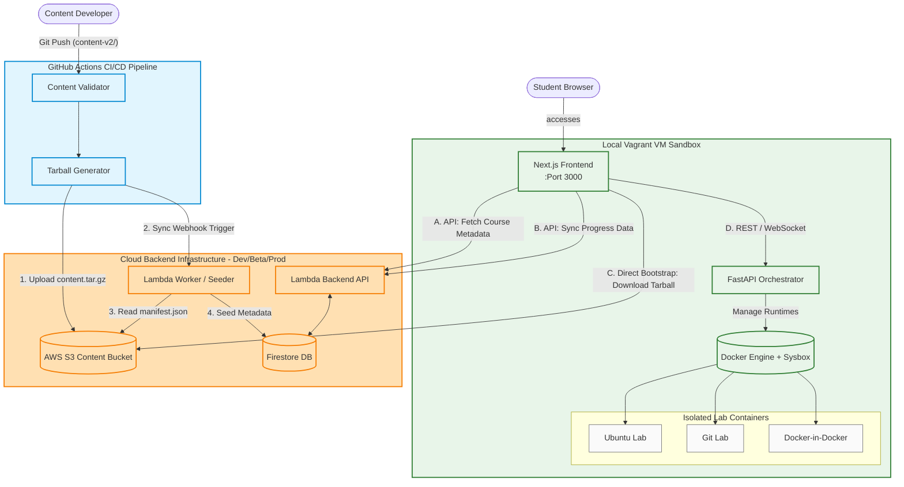

# LabOps Architecture Diagram

This is the auto-generated, clean architectural diagram for the entire SGP-V (LabOps) platform. It covers the end-to-end flow from content authoring and CI/CD publishing to the student's browser and the orchestrated Sysbox sandboxes.

### Components Breakdown:

1. **GitHub Actions CI/CD Pipeline:** Contains the validator and package generator. Checks YAML/Markdown formats, produces `content.tar.gz` and `manifest.json`, and uploads them to AWS S3.
2. **Cloud Backend & Infrastructure (AWS + Firestore):**
   - **AWS S3 Bucket**: Serves as the storage bucket for content tarballs.
   - **Lambda Worker**: A serverless function triggered via webhook to parse the new `manifest.json` and seed Firestore.
   - **Lambda Backend API**: Serves metadata to the frontend via API calls, handles user state / progression syncing, and does not serve content bytes or speak to the orchestrator.
   - **Firestore DB**: Holds course metadata index and user progress.
3. **Local Vagrant VM Sandbox (Student Machine):**
   - Runs a lightweight Vagrant VM. The **Next.js Frontend** is exposed (on Port 3000) to the student.
   - The **FastAPI Orchestrator** is internal to the VM and orchestrates the **Docker Engine + Sysbox** runtime to spin up secure, unprivileged system containers (Ubuntu, Git, Docker-in-Docker) for hands-on tasks.
   - Once the content tarball is bootstrapped from S3, the application runs entirely locally, only syncing progression back to the cloud database.

