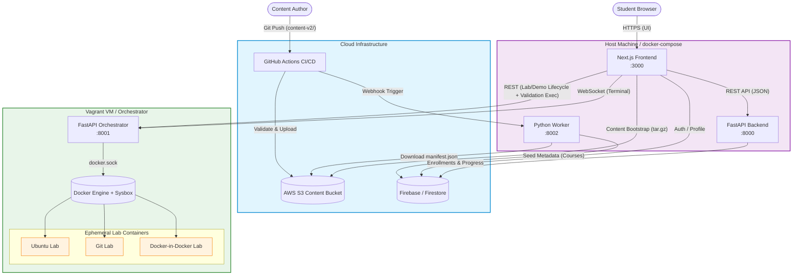

# LabOps Architecture Diagram

This is the auto-generated, clean architectural diagram for the entire SGP-V (LabOps) platform. It covers the end-to-end flow from content authoring and CI/CD publishing to the student's browser and the orchestrated Sysbox sandboxes.

### Components Breakdown:

1. **GitHub Actions + AWS S3:** The single source of truth for course content. Assets are packed into tarballs and synced directly to S3.
2. **Next.js Frontend:** Bootstraps course content directly from S3 (bypassing the backend for static assets), ensuring lightning-fast client-side routing.
3. **Python Worker:** Dedicated solely to seeding Firestore with structural course metadata (so the backend has an index for enrollment validation).
4. **FastAPI Backend:** Handles user state only—authentication, enrollments/progress, and the content-version handshake (`GET /api/v1/content/version` → S3 download URL). It serves **no** content bytes and makes **no** calls to the orchestrator.
5. **Orchestrator (Vagrant VM):** A tightly locked-down VM running Sysbox. The frontend talks to it **directly**—REST for lab/demo lifecycle and validation `exec`, WebSocket (`/ws/terminal`) for low-latency terminal rendering. It spawns per-student containers on the VM's Docker Engine.
