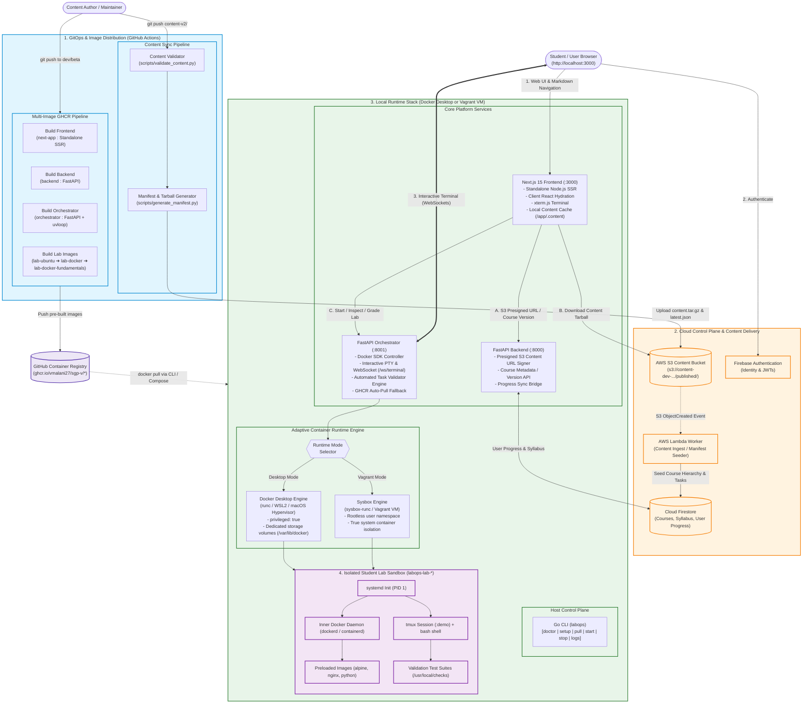

# LabOps Architecture & Component Blueprint

This document details the end-to-end architecture of **LabOps (SGP-V)**, a containerized, local-first learning platform for hands-on DevOps education.

---

## 1. System Architecture Diagram



---

## 2. Component Directory & Responsibilities

| Component | Technology | Primary Role |
|---|---|---|
| **`next-app` (Frontend)** | Next.js 15, React 19, Tailwind, xterm.js | Standalone SSR web application. Renders markdown course content, manages local tarball cache in `/app/.content`, and streams interactive shell sessions via WebSockets. |
| **`orchestrator`** | FastAPI, Python 3.12, `docker` SDK, `uvloop` | Manages lab container lifecycles (`start`, `stop`, `exec`), bridges terminal PTYs over WebSocket `/ws/terminal`, executes task verification scripts, and auto-pulls missing images from GHCR. |
| **`backend`** | FastAPI, Python 3.12, `google-cloud-firestore`, `boto3` | Generates presigned S3 download URLs for content delivery, syncs user course enrollment and progress state with Firestore. |
| **`lab-images`** | Ubuntu 22.04, systemd, Docker CE, containerd | Self-contained, multi-stage Linux lab environments running full systemd (PID 1) and inner `dockerd` with pre-cached exercise images. |
| **`cli` (`labops`)** | Go 1.22+ (Zero Dependencies) | Cross-platform bootstrap CLI for Windows, macOS, and Linux. Performs preflight checks (`doctor`), image pulling (`pull`), and interactive runtime selection (`start` / `stop`). |
| **`worker` (Lambda)** | Python 3.12 AWS Lambda | Ingests `latest.json` content manifests triggered by S3 uploads, parsing module and task metadata directly into Cloud Firestore. |

---

## 3. Communication Protocols & Security Boundaries

```
Browser  ───(HTTPS / WS)───►  Frontend (:3000)
   │                               │ (internal backendFetch)
   │                               ▼
   ├────────(HTTP / REST)────► Backend (:8000) ──► AWS S3 & Firestore
   │
   └────────(WS / Terminal)──► Orchestrator (:8001) ──► Docker Engine
                                                              │
                                                              ▼
                                                     [ Lab Sandbox ]
                                                     (Inner dockerd)
```

1. **Client Isolation:** The student browser connects to the Orchestrator WebSocket using a shared session secret. The student never has access to the host's `/var/run/docker.sock`.
2. **Inner Docker Isolation (DinD):**
   * **Sysbox Mode (Vagrant/Linux):** Linux user-namespaces map root inside the container to an unprivileged host UID.
   * **Docker Desktop Mode (Windows/macOS):** Runs inside the Hyper-V/Virtualization.framework micro-VM with dedicated `/var/lib/docker` volumes, eliminating overlayfs-on-overlayfs conflicts while isolating the host OS.
3. **Local-First Content Delivery:** The frontend fetches the course content tarball from S3 once, verifies its SHA256 checksum, and extracts it to `/app/.content`, providing fast offline-ready rendering.

