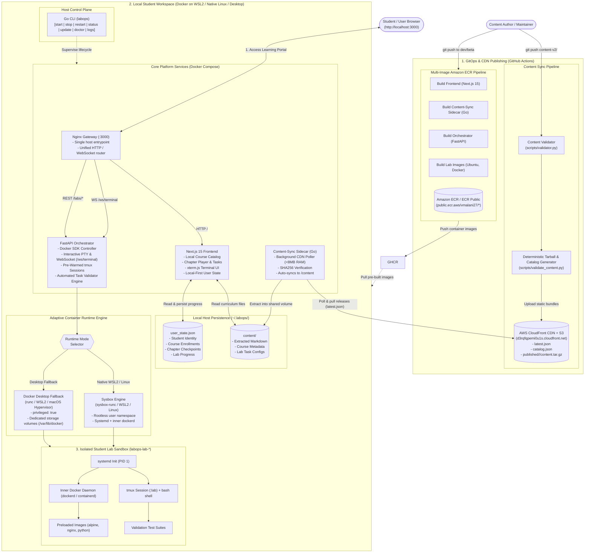

# LabOps Architecture & Component Blueprint

This document details the end-to-end architecture of **LabOps (SGP-V)**, a local-first, containerized learning platform for hands-on DevOps education.

---

## 1. System Architecture Diagram



---

## 2. Component Directory & Responsibilities

| Component | Technology | Primary Role |
|---|---|---|
| **`proxy` (Gateway)** | Nginx Alpine | Single unified reverse proxy on port 3000. Routes frontend SSR/static assets, orchestrator REST endpoints (`/labs/`, `/demos/`, `/health`), and WebSocket terminal sessions (`/ws/terminal`). |
| **`next-app` (Frontend)** | Next.js 15, React 19, Tailwind, xterm.js | Standalone SSR web application. Reads curriculum directly from local filesystem (`/app/.content`), manages student progress locally in `~/.labops/user_state.json`, and coordinates task validation. |
| **`content-sync` (Sidecar)** | Go 1.22+ (Alpine, < 8MB RAM) | Continuous background daemon. Polls CloudFront CDN (`latest.json`), validates SHA256 checksums, and safely extracts curriculum releases into the shared `/content` volume. |
| **`orchestrator`** | FastAPI, Python 3.12, Docker SDK, uvloop | Manages student sandbox lifecycles (`start`, `stop`, `exec`), bridges terminal PTYs over WebSocket `/ws/terminal` with pre-initialized `tmux` sessions, and executes task grading commands without exposing verification answers. |
| **`cli` (`labops`)** | Go 1.22+ (Zero Dependencies) | Cross-platform bootstrap CLI for Windows, macOS, and Linux. Provides zero-plumbing lifecycle controls (`start`, `stop`, `restart`, `status`, `update`, `doctor`, `logs`). |
| **`lab-images`** | Ubuntu 22.04, systemd, Docker CE, containerd | Self-contained Linux lab environments running full systemd (PID 1) and inner `dockerd` with pre-cached exercise images. |

---

## 3. Communication Protocols & Security Boundaries

```
Browser  ───(HTTP / WS on port 3000)───►  Nginx Gateway Proxy (:3000)
                                                 │
                   ┌─────────────────────────────┴─────────────────────────────┐
                   │                                                           │
                   ▼ (HTTP /)                                                  ▼ (WS & REST /labs)
           Next.js Frontend (:3000)                                     FastAPI Orchestrator (:8000)
                   │                                                           │
                   ▼                                                           ▼
      [ Local User State & Content ]                                     Docker Engine Socket
       (~/.labops/user_state.json)                                             │
                                                                               ▼
                                                                      [ Lab Sandbox (labops-lab-*) ]
                                                                      - systemd (PID 1)
                                                                      - inner dockerd
                                                                      - isolated tmux session
```

1. **Client Isolation:** The student browser connects to the Orchestrator WebSocket using a shared session secret. The student never has access to the host's `/var/run/docker.sock`.
2. **Inner Docker Isolation (DinD):**
   * **Sysbox Mode (WSL2 / Linux):** Linux user-namespaces map root inside the container to an unprivileged host UID.
   * **Docker Desktop Mode (Windows / macOS):** Runs inside the WSL2 / Hyper-V utility VM with dedicated `/var/lib/docker` volumes, eliminating overlayfs conflicts while isolating the host OS.
3. **Local-First Autonomy:** The platform functions completely offline once course materials and images are downloaded. All user progress and checkpoints are stored directly on the host machine in `~/.labops/user_state.json`.

